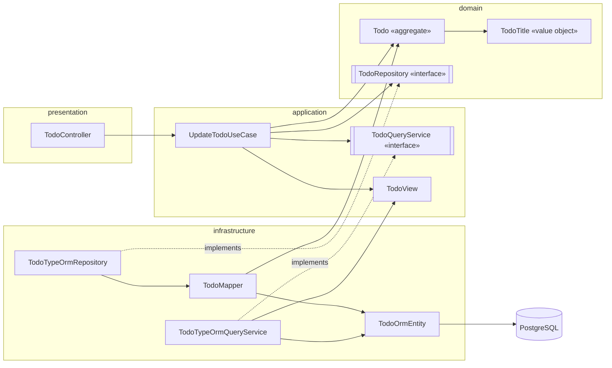
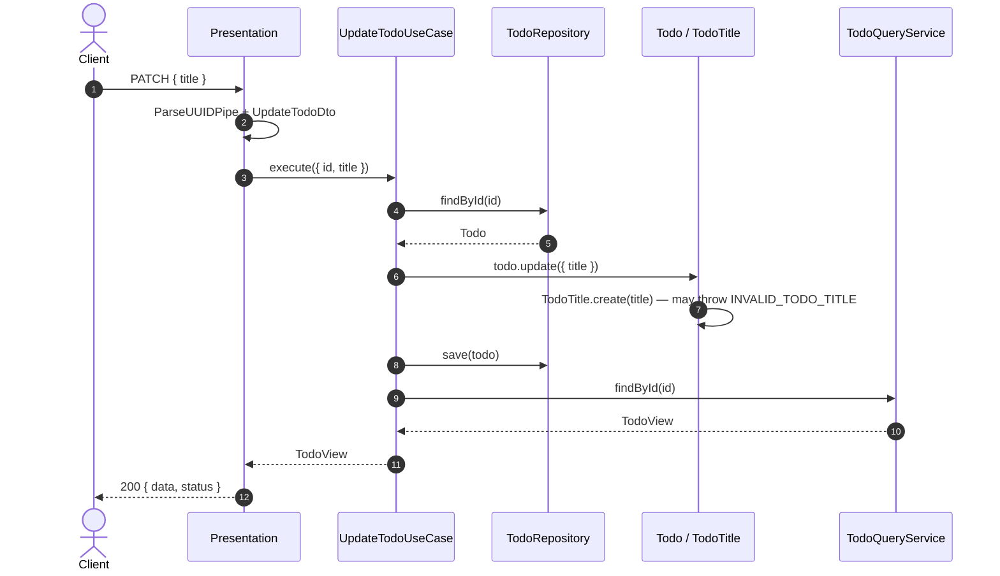

# NestJS Clean Architecture + DDD Starter

A starter for building REST APIs with **NestJS 12**, **TypeORM 1.x** and **PostgreSQL**, organised with **Clean Architecture** and **Domain-Driven Design**.

It ships with a complete reference module (`todo`) that shows every layer end to end. Copy its shape when you add a new bounded context.

## What's included

- **Layered modules:** `domain` / `application` / `infrastructure` / `presentation`, with dependencies pointing inward only.
- **Write/read split:** aggregates are saved through repositories; lists and details are read through query services straight into views.
- **Base classes:** `Entity`, `AggregateRoot`, `ValueObject`, `DomainException`, `TypeOrmBaseRepository`, `TypeOrmBaseQueryService`.
- **Standard API envelope:** every success and error response has the same shape. Pagination links and meta are built automatically.
- **Central error catalog:** all API error codes live in one file, with compile-time checks for duplicates and missing codes.
- **Audit columns** on every table (`is_active`, `created_*`, `updated_*`, `deleted_*`) and soft delete.
- **Validation:** `class-validator` with a global `ValidationPipe` that rejects unknown fields.
- **Tooling:** native ESM, Vitest, oxlint, Prettier, TypeORM migrations.

## Requirements

- Node.js **20.11+**
- PostgreSQL **14+**

## Quick start

```bash
# 1. Install
npm install

# 2. Configure
cp .env.example .env        # then fill in DATABASE_* values

# 3. Start a database (skip if you already have one)
docker run -d --name local-postgres -p 5432:5432 \
  -e POSTGRES_USER=root -e POSTGRES_PASSWORD=secret -e POSTGRES_DB=app \
  postgres:17-alpine

# 4. Create tables
npm run migration:run

# 5. Run
npm run start:dev
```

The API is served under `http://localhost:<PORT>/api/v1`. Try it:

```bash
curl -X POST http://localhost:3200/api/v1/todos \
  -H 'Content-Type: application/json' \
  -d '{"title":"Buy milk","description":"2 bottles"}'

curl 'http://localhost:3200/api/v1/todos?page=1&perPage=10'
```

## Configuration

| Variable | Description | Default |
|---|---|---|
| `PORT` | HTTP port | `3000` |
| `APP_URL` | Public base URL | `http://localhost:3000` |
| `DATABASE_TYPE` | TypeORM driver | `postgres` |
| `DATABASE_HOST` / `DATABASE_PORT` | Database address | – / `5432` |
| `DATABASE_NAME` | Database name | – |
| `DATABASE_NAME_TEST` | Database name used when `NODE_ENV=test` | – |
| `DATABASE_USER` / `DATABASE_PASSWORD` | Credentials | – |
| `DATABASE_SYNC` | TypeORM `synchronize`. Keep `false` outside local experiments and use migrations. The migration CLI always forces it off. | `false` |
| `PER_PAGE` | Default page size for list endpoints | `30` |
| `JWT_*` | Reserved for authentication (not implemented yet) | – |

`NODE_ENV=test` loads `.env.test` instead of `.env`.

## Scripts

| Command | Description |
|---|---|
| `npm run start:dev` | Start in watch mode |
| `npm run build` | Compile to `dist/` |
| `npm run start:prod` | Run the compiled app |
| `npm test` | Unit and integration tests (no database needed) |
| `npm run test:e2e` | End-to-end tests (needs a database and `.env.test`) |
| `npm run test:cov` | Tests with coverage |
| `npm run lint` | oxlint |
| `npm run format` | Prettier |
| `npx tsc --noEmit -p tsconfig.json` | Type-check, including specs (Vitest does not type-check) |
| `npm run migration:generate -- src/shared/infrastructure/database/migrations/<Name>` | Generate a migration from entity changes (needs a database) |
| `npm run migration:run` / `migration:revert` | Apply / roll back migrations |

The migration CLI builds first and runs against `dist/`, so no ts-node is needed.

## Architecture

```
presentation ──► application ──► domain ◄── infrastructure
```

| Layer | Responsibility | Contains | Must not |
|---|---|---|---|
| **domain** | Business rules and invariants | Aggregates, value objects, domain exceptions, repository **interfaces** | Import NestJS, TypeORM or any other layer |
| **application** | One use case per action: orchestrates domain objects | Use cases, views (read models), query service **interfaces** | Use TypeORM or decide business rules itself |
| **infrastructure** | Implements the interfaces with real technology | TypeORM repositories and query services, ORM entities, mappers | Contain business rules |
| **presentation** | Translates HTTP to use-case calls and back | Controllers, request DTOs, response interceptor, exception filter | Touch repositories, aggregates or ORM entities |

Rules that hold across the codebase:

- `shared/` is the shared kernel. Modules may use it, but it never imports a module.
- Modules never import each other.
- `app.module.ts`, `main.ts` and `error-codes.ts` form the composition root. This is the only place that knows every module.



### Write side vs read side

- **Commands** (create, update, delete):
  1. Load the aggregate through the repository.
  2. Call its methods. The invariants run there.
  3. Save or delete the aggregate.

  Deleting always loads the aggregate first, so its `delete()` rules apply.
- **Queries** (get, list) read ORM rows straight into a view through the query service. Pagination, filters and audit fields exist only on this side.
- POST and PATCH save through the repository, then read the result back through the query service.

### Request flow: `PATCH /api/v1/todos/:id`



## Project structure

```
src/
├── main.ts                       # bootstrap: /api prefix, URI versioning (v1)
├── app.module.ts                 # composition root
├── error-codes.ts                # API error code catalog
├── config/                       # env -> typed config
├── shared/                       # shared kernel
│   ├── domain/                   # Entity, AggregateRoot, ValueObject, DomainException, Repository port
│   ├── application/              # UseCase, QueryService port, Paginated, BaseView
│   ├── infrastructure/database/  # TypeORM config, BaseOrmEntity, base repository/query, migrations/
│   └── presentation/http/        # response interceptor, exception filter, validation pipe, pagination DTO
└── modules/
    └── todo/                     # reference module
        ├── domain/               # Todo, TodoTitle, exceptions, TodoRepository
        ├── application/          # use cases, TodoView, TodoQueryService
        ├── infrastructure/       # ORM entity, mapper, TypeORM repository + query service
        ├── presentation/         # controller, request DTOs
        ├── testing/              # in-memory adapters for specs
        └── todo.module.ts
```

## API conventions

### Success

A controller returns plain data. `ApiResponseInterceptor` wraps it.

```json
{
  "data": {
    "id": "1c6d5a24-7453-4e46-8b7f-f56ef1d564e6",
    "isActive": true,
    "createdDate": "2026-09-24T10:51:52.557Z",
    "createdBy": null,
    "updatedDate": "2026-09-24T10:51:52.557Z",
    "updatedBy": null,
    "deletedDate": null,
    "deletedBy": null,
    "title": "Buy milk",
    "description": null
  },
  "status": { "code": 200, "message": "OK" }
}
```

Returning a `Paginated<T>` adds `links` and `meta`:

```json
{
  "data": [ ... ],
  "links": {
    "first": "/api/v1/todos?perPage=10",
    "previous": "",
    "next": "/api/v1/todos?page=2&perPage=10",
    "last": "/api/v1/todos?page=3&perPage=10"
  },
  "meta": { "totalItems": 25, "itemCount": 10, "itemsPerPage": 10, "totalPages": 3, "currentPage": 1 },
  "status": { "code": 200, "message": "OK" }
}
```

- `status.code` is the real HTTP status, for example `201` for POST.
- `204` responses have no body.
- Empty values are `null`.

### Errors

```json
{
  "status": { "code": 404, "message": "Not Found" },
  "error": { "code": 100101, "message": "TODO_NOT_FOUND", "errors": [] }
}
```

- `error.message` is a stable error key.
- `error.code` comes from the catalog in `src/error-codes.ts`.
- `errors` lists validation messages when there are any.

| Source | HTTP | `error.code` / `error.message` |
|---|---|---|
| `DomainException` | from its type: `VALIDATION` 400, `UNAUTHORIZED` 401, `FORBIDDEN` 403, `NOT_FOUND` 404, `CONFLICT` 409, `BUSINESS_RULE` 422 | catalog code / its key |
| Request validation (`ValidationPipe`) | 400 | `900422 VALIDATE_ERROR` |
| Other 400 (e.g. malformed UUID) | 400 | `900423 BAD_REQUEST` |
| 401 / 403 | 401 / 403 | `900403 UNAUTHORIZED` |
| Anything else (unknown route, unhandled error) | 404 / 500 | `0 UNDEFINED_ERROR` (details are logged, never returned) |

### Error catalog

`src/error-codes.ts` is the single place where numeric codes are assigned. Everyone can see which codes are taken.

```ts
export const ErrorCodes = {
  0: 'UNDEFINED_ERROR',
  900422: 'VALIDATE_ERROR',
  // TODO 1001xx
  100101: 'TODO_NOT_FOUND',
  100106: 'INVALID_TODO_TITLE',
} as const satisfies Record<number, string>;
```

The domain only knows the key (`'TODO_NOT_FOUND'`), never the number. These guards catch mistakes when several people work in parallel:

- A duplicate code does not compile (TS1117).
- A key that is thrown but missing from the catalog does not compile. The error names the key.
- A duplicate key fails at startup and in `error-codes.spec.ts`.

Ranges: `9000xx` system, `1001xx` todo. Give each new module the next range: `1002xx`, `1003xx`, and so on.

## Adding a new module

Use `src/modules/todo` as the template. For a module `order`:

1. **Domain:** `modules/order/domain/`
   - `order.entity.ts`: `class Order extends AggregateRoot` with `create()`, `restore(props, id, isActive)` and behaviour methods
   - `value-objects/*.vo.ts`: `create(raw)` validates, `restore(stored)` trusts the database
   - `exceptions/order-error-key.ts`: `export const OrderErrorKey = { NOT_FOUND: 'ORDER_NOT_FOUND' } as const`
   - `exceptions/*.exception.ts`: `extends DomainException`
   - `order.repository.ts`: `interface OrderRepository extends Repository<Order>` and `ORDER_REPOSITORY`
2. **Application:** `modules/order/application/`
   - `order.view.ts`: `interface OrderView extends BaseView`
   - `order.query.ts`: `interface OrderQueryService extends QueryService<OrderView>` and `ORDER_QUERY_SERVICE`
   - `use-cases/*.use-case.ts`: one class per action, returning `OrderView`, `Paginated<OrderView>` or `void`
3. **Infrastructure:** `modules/order/infrastructure/persistence/`
   - `order.orm-entity.ts`: `@Entity('orders')`, `extends BaseOrmEntity`, with an explicit snake_case `name` on every column
   - `order.mapper.ts`: aggregate ↔ ORM entity; never writes audit columns
   - `order.typeorm-repository.ts`: `extends TypeOrmBaseRepository`
   - `order.typeorm-query.ts`: `extends TypeOrmBaseQueryService`, with `toView = { ...toBaseView(record), ...fields }`
4. **Presentation:** `modules/order/presentation/`
   - `order.controller.ts`: calls use cases and returns their results as-is
   - `dto/*.dto.ts`: `class-validator` request DTOs
5. **Module:** in `order.module.ts`, register `TypeOrmModule.forFeature([OrderOrmEntity])`, bind both ports, and add the use cases. Import the module in `app.module.ts`.
6. **Error codes:** add `1002xx` entries to `src/error-codes.ts` and add `OrderErrorKey` to `ThrownErrorKey`.
7. **Migration:** `npm run migration:generate -- src/shared/infrastructure/database/migrations/CreateOrders`
8. **Tests:** add an in-memory store in `modules/order/testing/` shared by both ports, then spec the entity, the use cases and the controller.

## Conventions

- **ESM imports:** use relative paths with the `.js` extension (`'./order.entity.js'`). Don't use tsconfig path aliases. Use `import.meta.url` instead of `__dirname`.
- **Identity:** UUIDs are generated in the domain (`randomUUID()`), so the primary key is `@PrimaryColumn`, not `@PrimaryGeneratedColumn`.
- **Naming:** the database uses snake_case and the code uses camelCase.
  - Set column names explicitly: `@Column({ name: 'due_date', ... }) dueDate`.
  - Name tables in plural snake_case.
- **Relations:** type relation properties as `Relation<T>` to avoid ESM circular-import errors.
- **Validation:**
  - DTOs check shape: type, required, length.
  - Value objects and aggregates check business meaning.
- **Tests:**
  - Specs sit next to the source file as `*.spec.ts`.
  - `testing/` folders hold test-only adapters and fixtures and are excluded from the build.
  - Shared specs never import a module.

Detailed rules for contributors and AI coding agents are in [CLAUDE.md](CLAUDE.md).

## Not included yet

- Authentication and current-user tracking. `createdBy`, `updatedBy` and `deletedBy` are always `null` for now.
- A domain event dispatcher. Aggregates can collect events, but nothing publishes them.
- Transactions / unit of work.
- Swagger / OpenAPI.
